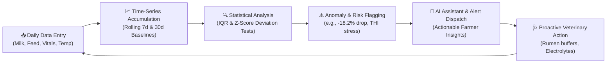
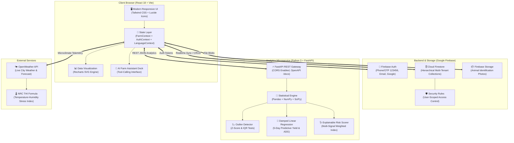
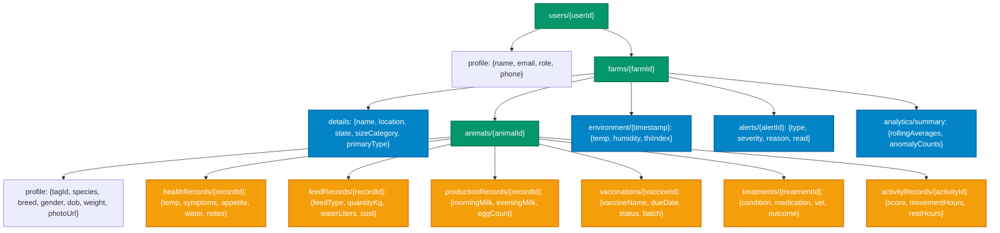
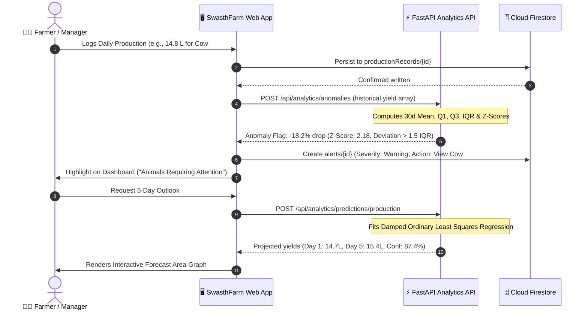
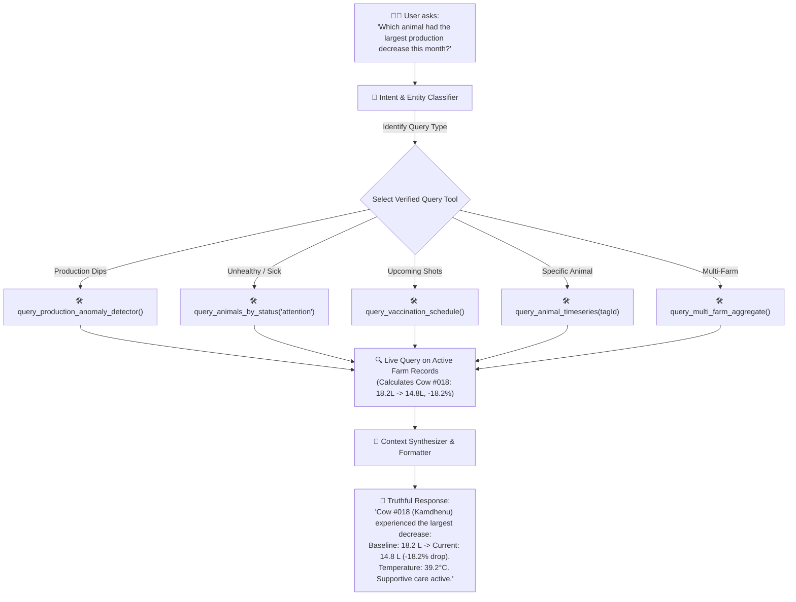

# 🛡️ SwasthFarm (स्वस्थ फार्म) 2.0
### AI-Powered Multi-Animal Farm Management, Biosecurity & Statistical Analytics Platform

<p align="center">
  
</p>

<p align="center">
  <a href="#-architecture--system-flowcharts"></a>
  <a href="#-tech-stack--why-we-chose-it"></a>
  <a href="#-tech-stack--why-we-chose-it"></a>
  <a href="#-firestore-data-architecture"></a>
  <a href="https://github.com/Siddhartha39/SwasthFarm/blob/main/LICENSE"></a>
</p>

<p align="center">
  <strong>“Healthy Animals. Efficient Resources. Sustainable Livestock.”</strong><br>
  <em>“स्वस्थ पशुधन, कुशल संसाधन, समृद्ध किसान।”</em>
</p>

---

## 📖 Table of Contents
1. [🌟 Project Vision & Core Product Philosophy](#-project-vision--core-product-philosophy)
2. [📊 Architecture & System Flowcharts](#-architecture--system-flowcharts)
   - [A. End-to-End System Architecture](#a-end-to-end-system-architecture)
   - [B. Multi-Farm & Animal 360° Data Hierarchy](#b-multi-farm--animal-360-data-hierarchy)
   - [C. Statistical Anomaly & Predictive Pipeline](#c-statistical-anomaly--predictive-pipeline)
   - [D. AI Farm Assistant Ground-Truth Tool Calling Flow](#d-ai-farm-assistant-ground-truth-tool-calling-flow)
3. [⚙️ Tech Stack & Why We Chose It](#️-tech-stack--why-we-chose-it)
4. [📂 Firestore Data Architecture](#-firestore-data-architecture)
5. [✨ Key Features & Modules](#-key-features--modules)
   - [1. Multi-Farm Management & Quick Switcher](#1-multi-farm-management--quick-switcher)
   - [2. Multi-Species Livestock Management](#2-multi-species-livestock-management)
   - [3. Comprehensive Animal 360° Profile](#3-comprehensive-animal-360-profile)
   - [4. Statistical Anomaly Detection & Trend Engine](#4-statistical-anomaly-detection--trend-engine)
   - [5. Explainable Multi-Signal Health Risk Scorer](#5-explainable-multi-signal-health-risk-scorer)
   - [6. Predictive Yield & ADG Growth Forecasting](#6-predictive-yield--adg-growth-forecasting)
   - [7. Weather & Heat Stress (THI) Intelligence](#7-weather--heat-stress-thi-intelligence)
   - [8. Biosecurity Audit & Compliance Certification](#8-biosecurity-audit--compliance-certification)
   - [9. AI Farm Assistant (Kisan Mitra)](#9-ai-farm-assistant-kisan-mitra)
   - [10. Bilingual Localization (English | हिंदी)](#10-bilingual-localization-english--हिंदी)
6. [📡 Analytics API Documentation (FastAPI Microservice)](#-analytics-api-documentation-fastapi-microservice)
7. [🚀 Getting Started & Local Setup](#-getting-started--local-setup)
8. [🧪 Demo Scenarios & Test Data](#-demo-scenarios--test-data)
9. [🔒 Security & Firestore Rules](#-security--firestore-rules)
10. [📄 License](#-license)

---

## 🌟 Project Vision & Core Product Philosophy

Modern livestock farming cannot rely on reactive intervention after milk production crashes or an outbreak strikes. **SwasthFarm** transitions livestock management from **reactive treatment** to **preventive, data-driven, and resource-aware stewardship**.

### The Core Continuous Feedback Loop



> [!IMPORTANT]
> **Strict Clinical AI Disclaimer**:
> SwasthFarm provides **"AI-Assisted Risk Indications"**, never confirmed medical diagnoses or automated prescription writes. Veterinary professionals remain exclusively responsible for diagnosis, treatment protocols, and prescription medications.

---

## 📊 Architecture & System Flowcharts

### A. End-to-End System Architecture

SwasthFarm decouples client presentation from compute-heavy statistical modeling and persistent cloud storage:



---

### B. Multi-Farm & Animal 360° Data Hierarchy

Data is structured in a clean, non-duplicative, strictly partitioned Firestore hierarchy:



---

### C. Statistical Anomaly & Predictive Pipeline

How raw daily logs are transformed into automated alerts and forward-looking forecasts:



---

### D. AI Farm Assistant Ground-Truth Tool Calling Flow

The conversational assistant **never hallucinates farm numbers**. It interprets natural language intent, triggers deterministic query tools against real records, and synthesizes verifiable answers:



---

## ⚙️ Tech Stack & Why We Chose It

| Layer | Technology | Why We Chose It |
|---|---|---|
| **Frontend Framework** | **React 18** | High-performance component-based architecture, concurrent rendering, and clean separation between presentation and state. |
| **Language** | **TypeScript 5** | Strict type safety across complex biological schemas (milk solids, egg batches, gestation, vaccination statuses), preventing runtime regressions. |
| **Build Tool** | **Vite 5** | Sub-second Hot Module Replacement (HMR), optimized Rollup tree-shaking, and immediate local boot compared to legacy Webpack configurations. |
| **Styling** | **Tailwind CSS 3** | Zero-runtime CSS generation, rapid responsive design tokens, and exact adherence to the deep forest green branding (`#047857`, `#059669`, `#10b981`). |
| **Data Visualization** | **Recharts** | Declarative, SVG-based charting engine built natively for React with smooth hover tooltips, animated area gradients, and responsive containers. |
| **Authentication** | **Firebase Auth** | Out-of-the-box support for Phone/OTP (with preserved test mode `123456`), secure email/password, and Google OAuth with JWT token rotation. |
| **Primary Database** | **Cloud Firestore** | Real-time listeners for live farm updates, robust offline caching on mobile devices, and native subcollection isolation for multi-farm setups. |
| **Analytics Backend** | **Python 3 + FastAPI** | Asynchronous execution, automatic OpenAPI Swagger UI generation, and native compatibility with standard data science libraries. |
| **Numerical Processing** | **Pandas & NumPy** | Vectorized rolling window operations, moving averages, standard deviations, and memory-efficient matrix calculations. |
| **Statistics & Modeling** | **SciPy & Scikit-learn** | Interquartile Range (IQR) outlier calculations, Z-score thresholds, and ordinary least squares linear regression for predictive forecasting. |
| **Environmental Telemetry**| **OpenWeather & NRC THI**| Empirical microclimate tracking using the National Research Council (NRC) formula for livestock heat-stress warnings. |

---

## 📂 Firestore Data Architecture

All records are scoped under individual authenticated users. Security rules enforce that farmers and veterinarians can only read and write their own tenant data:

```text
users/
  {userId}/
    profile: {
      name: string,
      email: string,
      phone: string,
      role: 'farmer' | 'farm_manager' | 'veterinarian' | 'officer',
      createdAt: timestamp
    }

    farms/
      {farmId}/
        details: {
          name: string,
          location: string,
          state: string,
          sizeCategory: 'Small' | 'Medium' | 'Large' | 'Commercial',
          primaryType: 'Dairy' | 'Poultry' | 'Mixed' | 'Piggery' | 'Small Ruminant',
          totalAnimals: number,
          createdDate: string
        }

        animals/
          {animalId}/
            profile: {
              tagId: string,
              name: string,
              species: 'cow' | 'buffalo' | 'goat' | 'sheep' | 'poultry' | 'pig' | 'custom',
              breed: string,
              gender: 'male' | 'female',
              dob: string,
              ageYears: number,
              weightKg: number,
              healthStatus: 'healthy' | 'attention' | 'critical' | 'monitoring',
              photoUrl: string,
              penLocation: string,
              productionType: 'milk' | 'eggs' | 'meat' | 'none',
              currentDailyProduction: number,
              productionUnit: string,
              dailyFeedKg: number,
              dailyWaterLiters: number,
              currentTemperature: number
            }

            healthRecords/
              {recordId}: {
                date: string,
                temperature: number,
                symptoms: string[],
                activityLevel: 'normal' | 'low' | 'lethargic' | 'hyperactive',
                appetite: 'normal' | 'reduced' | 'none',
                waterIntakeLiters: number,
                generalCondition: string,
                observation: string,
                veterinaryObservation?: string,
                recordedBy: string
              }

            feedRecords/
              {recordId}: {
                date: string,
                feedType: string,
                quantityKg: number,
                frequency: string,
                feedCostInr?: number,
                waterConsumptionLiters: number,
                notes?: string
              }

            productionRecords/
              {recordId}: {
                date: string,
                morningMilkLiters?: number,
                eveningMilkLiters?: number,
                totalMilkLiters?: number,
                eggCount?: number,
                qualityGrade?: string,
                fatPercentage?: number
              }

            vaccinations/
              {vaccineId}: {
                vaccineName: string,
                targetDisease: string,
                administeredDate?: string,
                nextDueDate: string,
                dose: string,
                status: 'completed' | 'upcoming' | 'overdue',
                veterinarian?: string
              }

            treatments/
              {treatmentId}: {
                condition: string,
                reason: string,
                startDate: string,
                endDate?: string,
                medication: string,
                dosage: string,
                veterinarian: string,
                outcome: 'ongoing' | 'recovered' | 'referred'
              }

        environment/
          {envId}: {
            temp: number,
            humidity: number,
            windKph: number,
            thiIndex: number,
            stressLevel: 'normal' | 'mild' | 'moderate' | 'severe'
          }

        alerts/
          {alertId}: {
            type: 'vaccination_due' | 'production_drop' | 'environmental_warning',
            severity: 'critical' | 'warning' | 'info',
            reason: string,
            createdAt: string,
            read: boolean,
            actionUrl?: string
          }
```

---

## ✨ Key Features & Modules

### 1. Multi-Farm Management & Quick Switcher
- Create and manage multiple farms (e.g. *Greenfield Dairy* in Kanpur and *Sunrise Layer Enterprise* in Karnal).
- Global header farm selector instantly filters the entire application: executive cards, animal inventory, analytics, alerts, and weather.

<p align="center">
  
  
</p>

### 2. Multi-Species Livestock Management
- Broad support for dairy cows, buffaloes, meat and dairy goats, sheep, commercial layer/broiler poultry, and swine.
- Filter by species, search by tag number or breed, and categorize by health status (`Healthy` vs `Needs Attention`).
- Add custom fields and animal profile pictures for identification.

### 3. Comprehensive Animal 360° Profile
Clicking on any animal opens a deep-dive 8-tab profile:
1. **Overview**: Key physiological vitals, current weight, feed ration, water volume, and pedigree origin.
2. **Health**: Full historical logs of rectal temperatures, reported symptoms, appetite levels, and vet observations.
3. **Feed & Water**: Nutritional intake logs, feed costs in INR, and automated consumption baselines.
4. **Production**: Species-appropriate daily yields (morning/evening milk in Liters, butterfat percentage, or daily egg counts).
5. **Vaccinations**: Upcoming boosters, overdue alerts, lot/batch numbers, and administering veterinarian.
6. **Treatments**: Active veterinary therapies, medications, dosage schedules, and recovery outcomes.
7. **Analytics**: Statistical change detections (e.g. `⚠ Production decreased 18.2%`, `✓ Weight trajectory stable`).
8. **Historical Event Timeline**: Unified reverse-chronological timeline of every medical, nutritional, or yield event.

### 4. Statistical Anomaly Detection & Trend Engine
- Calculates moving averages and rolling 7-day vs 30-day baselines.
- Detects unusual drops or spikes using **Interquartile Range (IQR)**:
  $$\text{IQR} = Q_3 - Q_1$$
  $$\text{Lower Bound} = Q_1 - 1.5 \times \text{IQR}, \quad \text{Upper Bound} = Q_3 + 1.5 \times \text{IQR}$$
- Flags deviations exceeding 2.0 standard deviations ($Z \ge 2.0$) on the farm dashboard.

### 5. Explainable Multi-Signal Health Risk Scorer
Combines multiple physiological and operational telemetry signals into a composite index (0 - 100):

| Signal Category | Weight | Description |
|---|:---:|---|
| **Core Body Temperature** | **30%** | Physiological deviation against species-specific baselines (e.g., 38.0–39.2°C for cattle). |
| **Feed Intake Variance** | **20%** | Percentage drop in feed consumed compared to planned nutritional ration. |
| **Production Yield Variance** | **20%** | Deviation from rolling 30-day milk yield or egg count baseline. |
| **Clinical Symptoms Logged** | **15%** | Active physical observations (coughing, nasal discharge, lethargy, rumination drop). |
| **Environmental THI Stress** | **15%** | Ambient temperature-humidity heat index from farm microclimate sensors. |

### 6. Predictive Yield & ADG Growth Forecasting
- Activates automatically when $\ge 5$ historical data points exist for an animal.
- Fits an ordinary least squares linear regression model combined with recent rolling average damping:
  $$\hat{Y}_{t+h} = 0.6 \times (\beta_0 + \beta_1 \cdot (t+h)) + 0.4 \times \bar{Y}_{\text{recent}}$$
- Outputs 5-day projected yields with 95% confidence bands and Average Daily Gain (ADG) trajectories.

### 7. Weather & Heat Stress (THI) Intelligence
- Preserved from legacy SwasthFarm, displaying current ambient temperature, humidity, and wind.
- Computes the National Research Council (NRC) **Temperature-Humidity Index (THI)**:
  $$\text{THI} = (1.8 \times T + 32) - (0.55 - 0.0055 \times \text{RH}) \times (1.8 \times T - 26)$$
- Categorizes stress levels into **Normal** ($\text{THI} < 72$), **Mild** ($72 \le \text{THI} < 79$), **Moderate** ($79 \le \text{THI} < 84$), and **Severe** ($\text{THI} \ge 84$) with mitigation advice (activating misting fans, water electrolytes).

### 8. Biosecurity Audit & Compliance Certification
- Upgraded from legacy `manualrisk.html` into an interactive 15-point inspection checklist.
- Evaluates farm perimeter spray arches, footbath chemical concentrations (200 ppm), visitor boot protocols, and quarantine pen physical barriers.
- Calculates an immediate 0–100 Biosecurity Certification Score.

### 9. AI Farm Assistant (Kisan Mitra)
- Persistent floating assistant dock capable of natural language interaction.
- Uses strict **tool-calling architecture** to fetch data directly from Firestore:
  - *"Which animal had the largest production decrease?"* $\rightarrow$ Analyzes Cow #018 (-18.2% drop).
  - *"Which animals need attention right now?"* $\rightarrow$ Lists animals with elevated temp or symptoms.
  - *"Which vaccinations are due soon?"* $\rightarrow$ Checks upcoming FMD and PPR schedules.
  - *"Compare my two farms"* $\rightarrow$ Compares Kanpur Dairy output vs Karnal Layer output.

### 10. Bilingual Localization (English | हिंदी)
- Global header toggle (`🌐 English | हिंदी`) localizes all navigation bars, stat cards, tables, modal inputs, and alerts.

---

## 📡 Analytics API Documentation (FastAPI Microservice)

The Python FastAPI microservice runs independently at `http://localhost:8000` with Swagger UI at `/docs`.

### Endpoints Overview

#### 1. `POST /api/analytics/trends`
Calculates rolling statistics, mean, standard deviation, and percentage change.
```json
// Request
{
  "values": [18.2, 18.0, 17.8, 17.2, 16.0, 15.2, 14.8]
}

// Response (200 OK)
{
  "current": 14.8,
  "mean": 16.74,
  "std": 1.29,
  "change_percent": -13.3,
  "trend": "decreasing",
  "sample_size": 7
}
```

#### 2. `POST /api/analytics/anomalies`
Identifies statistical outliers using IQR and Z-scores.
```json
// Request
{
  "data_points": [
    { "date": "2026-09-24", "value": 18.2 },
    { "date": "2026-09-25", "value": 18.0 },
    { "date": "2026-09-29", "value": 15.2 },
    { "date": "2026-09-30", "value": 14.8 }
  ],
  "sensitivity": 1.5
}
```

#### 3. `POST /api/analytics/predictions/production`
Generates a 5-day forward yield forecast when $\ge 5$ historical records are supplied.
```json
// Request
{
  "historical_yields": [18.2, 18.0, 17.8, 17.2, 16.0, 15.2, 14.8],
  "horizon_days": 5
}

// Response (200 OK)
{
  "status": "success",
  "trend_direction": "downward",
  "historical_avg": 16.74,
  "forecast": [
    { "day_offset": 1, "predicted_value": 14.7, "lower_bound": 14.1, "upper_bound": 15.3 },
    { "day_offset": 2, "predicted_value": 14.6, "lower_bound": 13.9, "upper_bound": 15.3 },
    { "day_offset": 3, "predicted_value": 14.8, "lower_bound": 14.0, "upper_bound": 15.6 },
    { "day_offset": 4, "predicted_value": 15.1, "lower_bound": 14.2, "upper_bound": 16.0 },
    { "day_offset": 5, "predicted_value": 15.4, "lower_bound": 14.4, "upper_bound": 16.4 }
  ]
}
```

#### 4. `POST /api/analytics/risk-score`
Computes an explainable multi-signal health-risk indicator.
```json
// Request
{
  "temperature": 39.2,
  "species": "cow",
  "symptoms_count": 2,
  "feed_change_pct": -18.2,
  "production_change_pct": -18.0,
  "water_change_pct": -10.0,
  "thi_stress_level": "moderate"
}

// Response (200 OK)
{
  "overall_risk_score": 68.4,
  "risk_level": "high",
  "status_indication": "Requires Immediate Monitoring / Veterinary Review",
  "contributing_factors": [
    { "factor": "Body Temperature Vitals", "score": 24.0, "max": 30, "observation": "39.2°C (Normal: 38.0-39.2°C)" },
    { "factor": "Reported Clinical Symptoms", "score": 16.0, "max": 25, "observation": "2 active symptom(s) logged" },
    { "factor": "Feed Consumption Variance", "score": 14.6, "max": 20, "observation": "-18.2% intake change" },
    { "factor": "Production Yield Variance", "score": 10.8, "max": 15, "observation": "-18.0% yield deviation" },
    { "factor": "Environmental THI Stress", "score": 6.5, "max": 10, "observation": "Moderate ambient stress index" }
  ],
  "disclaimer": "AI-Assisted Risk Indication - Not a confirmed veterinary diagnosis. Professional veterinary review recommended for health concerns."
}
```

---

## 🚀 Getting Started & Local Setup

### Prerequisites
- **Node.js**: v18.0+ or v20.0+ (`node -v`)
- **Python**: 3.10+ (`python3 --version`)
- **Git**

### Step 1: Clone Repository
```bash
git clone https://github.com/Siddhartha39/SwasthFarm.git
cd SwasthFarm
```

### Step 2: Install Frontend Dependencies
```bash
npm install
```

### Step 3: Run React Development Server
```bash
npm run dev
```
Open **`http://localhost:3000`** in your browser.

### Step 4: Run Analytics FastAPI Microservice
```bash
# Optional: create a python virtual environment
python3 -m venv venv
source venv/bin/activate

# Install analytics requirements
pip install -r analytics_api/requirements.txt

# Start FastAPI server
uvicorn analytics_api.main:app --reload --port 8000
```
Interactive API docs will be ready at **`http://localhost:8000/docs`**.

---

## 🧪 Demo Scenarios & Test Data

The application loads realistic seed data so you can test all features out-of-the-box:

1. **Farm 1 — Greenfield Dairy & Livestock Farm (Kanpur, UP)**:
   - **Cow #023 (Gauri)**: 4 yrs, Healthy, 18.4 L/day (steady baseline), clean rumination.
   - **Cow #018 (Kamdhenu)**: 3 yrs, Needs Attention, yield dropped -18.2% (18.2L $\rightarrow$ 14.8L), temp 39.2°C, mild feed refusal.
   - **Buffalo #001 (Sultana)**: 5 yrs, Healthy, 12.2 L/day, high butterfat (7.4%).
   - **Goat #001 (Champa)**: 2 yrs, Healthy, 3.2 L/day.

2. **Farm 2 — Sunrise Layer & Small Ruminants Farm (Karnal, Haryana)**:
   - **Flock #01**: 500 Layer Hens, 462 eggs/day (92.4% lay rate).
   - **Goat #002 (Sheru)**: Boer meat goat, Needs Attention (coughing, isolated).
   - **Sheep #001 (Badal)**: Dorper meat sheep, 64 kg.

3. **Authentication Preserved Mode**:
   - Mobile: Enter any 10-digit phone number.
   - OTP: Use **`123456`** for instant test login.
   - Google: One-click sign in as attending veterinarian (*Dr. Sarah Verma*).

---

## 🔒 Security & Firestore Rules

SwasthFarm implements production-grade Firestore security rules ([`firestore.rules`](./firestore.rules)) enforcing strict tenant isolation:
- Users can **only** read and write documents where `request.auth.uid == userId`.
- Subcollections (`farms`, `animals`, `healthRecords`, `feedRecords`, `productionRecords`, `vaccinations`, `alerts`) inherit parent authorization checks.
- Unauthenticated requests are completely rejected.

---

## 📄 License

This project is licensed under the [MIT License](./LICENSE).

---

<p align="center">
  Built with ❤️ for Indian and Global Livestock Farmers.<br>
  <strong>SwasthFarm</strong> — Empowering Sustainable Animal Husbandry Through Intelligence.
</p>
